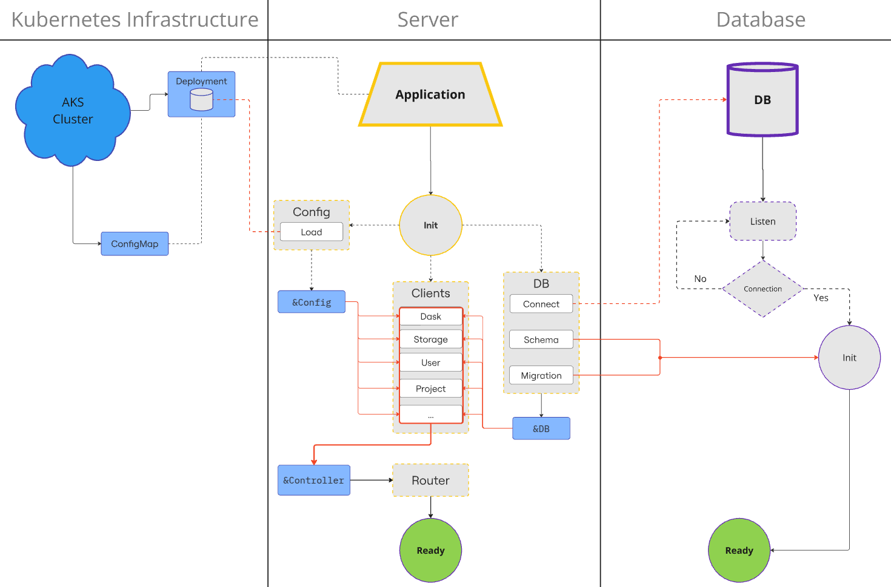

# Cover

## Description
A powerpoint specifically outlining and breaking down significant architectural
issues with our SaaS platform

GEOANALYTICS CANADA
Code Architecture
Pt. 1: Current Issues
Information Systems & Technology
Jordan Godau
Virtual/Online
March 2025

## Outline
1. Addressing current architectural challenges
2. Reviewing the SOLID principles
3. Impact on scalability, maintainability, and productivity
4. Proposing a solution for improvement.

## Current state
Problem Statement:
We have top-level objects intended to provide abstracted responsibilities, without
appropriate architectural layering:
- Objects have adopted globally-scoped responsibilities,
- Parameters are being passed in a "drill-down" manner to low-level packages.
- Tight-coupling behavior between mutually exclusive packages in the platform.
- Each package has become dependent on all other packages.
- 
These implementations will eventually demand that our entire existing codebase be
changed to accommodate them. The resulting state of the platform will be one that is:
- fragile,
- error-prone, and,
- maintainable only by those who created it.

## SOLID Design Principles
### Overview
Laws and principles of programming design can be reasonably argued as a
side-effect of well-designed code.

Nonetheless,

We can use the SOLID principles as a model and reference point for correctly
designed code architecture.


### Definition
SOLID is a pneumonic acronym for five well-known principles that promote maintainable software designs.

For our purposes:
- "L" and "D" can be ignored, since we are not leveraging polymorphism, and only "dabbling" in interface design
- However, we are in gross violation of "S", "O", and "I".

### Recap: **S**ingle Responsibility Principle
> A class should do one thing, and therefor, should have only a single reason to change.

#### Key Points:
**Module/Package Compatibility:**
- Teams should not have to change the same module for different reasons.
**Version Control:**
- Tags/Commits/Branches should be easy to trace back to a specific package.
**Feature Rollback:**
- It should be easy to rollback to an older version of a package/module.
**Merge Conflict Reduction:**
- Changes should be restricted to the bounds of a module.

### Recap: **O**pen-Closed Principle
> Implementations should be **open for extension** and **closed for modification**.

**Modification:** Changing the code of an existing module.

**Extension:** Adding new functionality to an existing module.

#### Key Points:
- Developers should be able to extend the functionality of a module without touching existing code.
- To the point above, whenever we modify existing code, we incur a risk of creating bugs.
- Developers should not be required to change parameters or existing logic to accommodate new features.

### Recap: **I**nterface Segregation Principle
> Many client-specific interfaces is better than one general-purpose interface.

> Clients should not be forced to implement a function they do not need.

**Modification:** Changing the code of an existing module.

**Extension:** Adding new functionality to an existing module.

#### Key Points:
- Strives to promote flexibility by maintaining strict segregation of client functionality.
- Packages/modules should not be forced to depend on attributes/actions they do not use.
- Reduces coupling and/or unintended behavior in mutually exclusive packages.

## ARCHITECTURAL ISSUES

### Symptoms in GeoAnalytics
**Homogenization of input parameters:**
- Parameters of mutually-exclusive packages are growing in similarity.
- Updates to packages are demanding changes in unrelated areas.
- This is a sign of increasing dependence on high-level objects.
**Steadily increasing argument counts:**
- Number of arguments required for functions continues to grow.
- Argument growth is happening is several places across the platform.
- Upwards of 13 required arguments for publicly exposed methods.
**Inability to run package/module code independently:**
- Packages and/or modules cannot be run as standalone utilities
- Execution of new features demands end-to-end completion
- CRUD operations dependent on threaded tasks and web requests
**Steadily increasing code complexity:**
- Development should become easier and faster with time by leveraging existing efforts.
- Instead, it is becoming more difficult, reusable logic is not being preserved.
- Client-specific implementations are adopting too many responsibilities.
- Productivity is impacted because of deciphering logic, rather than re-using it.

### Key Issues: Application Code
**Global Initialization Parameters:**
- Initial configurations are being passed down as drill-down arguments.
- Changes to infrastructure configurations cause unexpected behavior.
- Loaded configurations are not decomposed and passed off to lower-level implementations
- Instead, the configuration object is being passed directly to lower-level modules.
**Controller:**
- Controller is taking on too much responsibility.
- Tightly-couples too many aspects of the application code.
- Parameter of controller is passed as drill-down arguments to lower-level packages.
**Controller Payload:**
- Payload data is not released from the controller and decomposed.
- Instead, payload object is being passed directly to lower-level modules.
- Payload depends explicitly on concurrent operations,
- Lower-level modules have become dependent on unpredictable threaded operations.

### Key Issues: Platform Components
When referring to "platform components," this means:
- Server
- Webportal
- Database
- Kubernetes Infrastructure
- Azure Cloud infrastructure

Implementations for platform components should be strictly segregated.

We have **tight-coupling occurring between mutually exclusive platform components**:
- Database and Server
- Kubernetes Infrastructure and Server

### Coupling: Server and Database
Schema and migration logic are currently managed and executed by the server.

Coupling these components raises a number of issues:
**Separation of Concerns**
- **Maintainability:** Makes the codebase more difficult to understand and maintain.
- **Modularity:** Database development breaks server and client code.

**Version Control and Deployment**
- Controlled Migrations: Migration tools offer better version control for database schema changes and migrations
- Deployment Pipelines: Restricts integration of DB updates as part of the CI/CD process.

**Testing and Reliability**
- **Isolated Development:** Migration logic or schema changes interfere with server functionality.
- **Rollback Mechanisms:** Unable to leverage migration tools for rollback of changes in case of failures.

**Security and Access Control**
- **Limits Exposure:** Coupled database logic increases the surface area for security vulnerabilities.

**Collaboration**
- **Parallel Development:** Parallel development efforts are blocked, hurting productivity.

### Coupling: Server and Kubernetes Infrastructure
Configurations managed through Kubernetes manifests are being passed as drill-down arguments.

Allowing configuration issues to propagate undetected until runtime:
- Compromises the stability of the server
- Leads to undefined behaviors and increased operational risks.

#### Delayed Issue Detection
**Runtime Failures**
- Errors don't occur during deployment,
- Instead surfacing when specific client interactions occur.
**Inconsistent Behavior**
- Application behaves unpredictably, causing inconsistent UX
- Misleading errors that are difficult to debug due to late detection

### Increased System Fragility
**Data/Model/Logic Synchronization**
- Parsing of serialization formats (e.g., YAML) is risk.
- High risk of mismatch in schema, models, and logic.
**Propagation of Invalid Data**
- Parsing fails silently, loading incorrect data into application code
- Creates dependencies that can cascade failures across the system.

## Architectural Anti-Pattern Diagram



## Proposed Solution: Keys to Victory
1. **Incur a minimal impact on continued development**
2. **Preserve working system behavior with a careful rollout strategy**


### Approach
**De-couple intra-module dependencies:**
- Remove Data-members: Eliminate client data members from other clients to establish clear separation of concerns
- Input Parameters: Ensure publicly exposed client functionality accepts golang stdlib input arguments

**Minimize user-defined concurrent behavior:**
- Error-prone: Should only be done when necessary – otherwise, should be avoided.
- Use packages: Leverage concurrency already-provided by existing packages (e.g. gin, k8s Informer API).
- K.I.S.S.: To address access to critical regions (like DB read operations), utilize a mutex or semaphore.
- Long-running Requests: Leverage the trimmed down Controller implementation as a task queue

**Establish Proper Layering:**
- **Decompose Params:** Return golang standard types wherever possible to keep modules dependency free.
- **Fix Drilldown Args:** Instead of drilling args down, extract appropriately scoped values from deployment configurations
- **Follow the semantics:** Client-implementation arguments should have a semantic and obvious meaning

**Establish a clear and obvious pattern to codebase:**
- Create meaningful and predictable expectations for behavior from commonly encountered identifiers (e.g., Client)
- Improve modularity for saving time in new projects

## Proposed Solution: Codebase Re-architecture

### Semantic Hierarchal Naming

Code implementations and codebase file-trees should tell the same story:
- Common names should be accompanied by common behavior
- Common behavior creates common understanding

Almost every module in the Server application codebase fits the model:
- `<module>`
  - `client.go`
  - `const.go`
  - `env.go`
  - `config.go`
  - `alias.go`
  - `types.go`

### Patterns Through Semantics
Idiomatic identifiers should be opinionated in the scope of their functionality and responsibility.

For example:
#### `cmd/main.go`
**Responsibility:** Entry point and runnable for the Server
- Initializes the routers
- Validates and initializes global and environment-specific config values
- Performs singleton/global object initialization (E.g., DB Client, Logger)

#### `client.go`
**Responsibility:** Expose CRUD operations for conducting API logic.
- Should almost always accept stdlib types (e.g., "name string")
- Parameter names should be semantically relatable to the associated module
- User-defined types are acceptable if:
  - Defined in the same module
  - Publicly Exposed
- Should NOT embed or add user-defined clients as data-members:
  - This causes coupling issues between modules
  - In this instance, both should depend on a shared interface
  - Unless this was the initial intent (E.g., Creating k8s-enabled clients)

#### `type.go`
**Responsibility:** Contain type/model definitions for the package
- Should **appropriately** control visibility/exposure of declared types

#### `const.go`
**Responsibility:** Contains constant values with package-scoped meaning
- Should container almost entirely publicly exposed values.
- Should leverage the package name to enhance semantics:
- `dask.DaskClusterRunning` (bad)
- `dask.ClusterRunning` (good)

#### `alias.go`
**Responsibility:** Contains type aliases for imported package types
- Used as a means of enhancing semantic meaning, and
- Improve readability for complex or overly verbose implementations
- Centralize use of external types within the module.

**Example:** 
```go
package informer

import "k8s.io/client-go/informers"

// Convoluted type name is assigned to an alias that is appopriate for our informer package.
// This provides a shorter references, and focuses on it's purpose within our package.

type Opt = informers.SharedInformerOption
```


