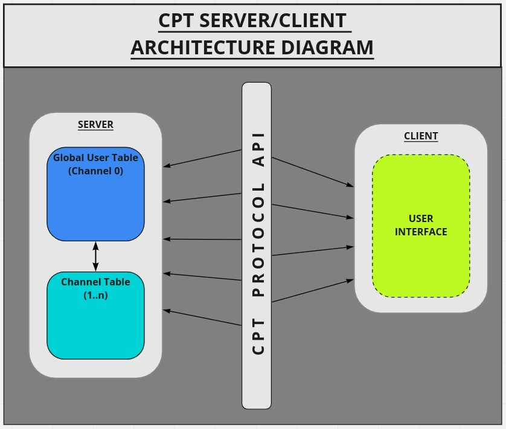
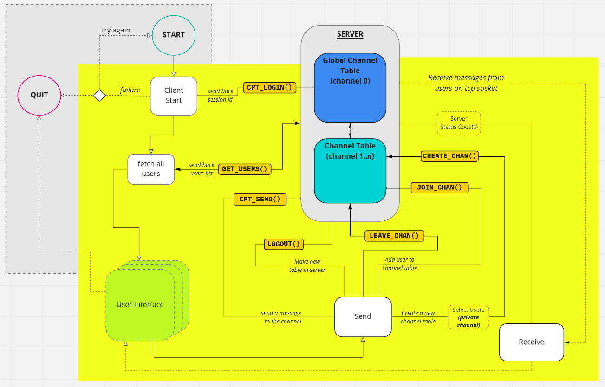
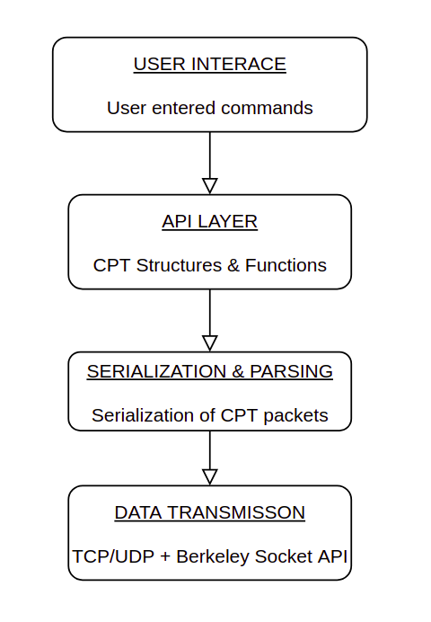
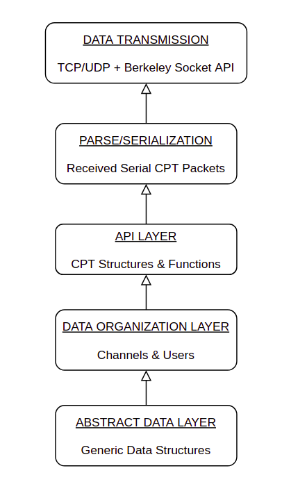

# GiJo: A Sophisticated Network Architecture in C

## Project Overview

GiJo represents a pivotal moment in my technical journey—a C-based networking application that 
sparked my passion for software architecture and system design. Though originally developed as a school 
project, its elegant design principles and sophisticated implementation of low-level networking concepts 
demonstrate advanced programming capabilities and architectural thinking.

This project implements a custom-designed chat protocol using the Berkeley Sockets API, enabling reliable 
communication between networked clients while demonstrating mastery of concurrent programming principles 
and network protocol design.

## Architectural Philosophy

The architecture embodies several key design principles:

1. **Separation of Concerns**: Clear boundaries between networking, protocol implementation, and application logic
2. **Modularity**: Self-contained components with well-defined interfaces
3. **Protocol Simplicity**: A carefully designed messaging system that handles only what's necessary
4. **Resource Efficiency**: Careful memory management and performance considerations
5. **Polymorphism in C**: Advanced object-oriented patterns implemented in pure C
6. **Dual-Protocol Support**: TCP for reliable messaging and UDP for real-time voice

## Technical Architecture

The system follows a layered architecture with clean separation between components:
```
GiJo/
├── networking/ # Low-level network communication
│   ├── tcp/    # Reliable stream-based communication
│   └── udp/    # Datagram-based communication for voice
├── api/        # Custom Protocol Implementation (CPT)
├── common/     # Shared utilities and structures
│   └── list/   # Generic polymorphic data structure
├── messenger/  # Message processing and routing
├── interface/  # Client-facing API
├── voice/      # Real-time audio communication
└── app/        # Application-level implementation
```

### Client/Server High-level Diagram



### GiJo Protocol Client Design



## Code Architecture

### Client-side Layers


### Server-side Layers


### Layered Code Architecture

### 1. Network Layer Implementation

The network layer demonstrates sophisticated socket programming:

- **TCP Implementation**
    - Socket initialization and configuration
    - Connection establishment and termination
    - Stream-based data transmission with error handling
    - Client connection tracking
    - Non-blocking I/O for concurrent connections

- **UDP Implementation**
    - Datagram-based communication for voice
    - Connectionless message passing
    - Optimized for real-time audio data
    - Low-latency packet handling

The Berkeley Sockets implementation showcases understanding of:
- Socket address structures
- Network byte ordering
- Connection backlog management
- Socket options configuration
- Error handling and recovery

### 2. Custom Protocol Design (CPT)

The heart of the system is a meticulously designed chat protocol:

- **Message Format**
    - Structured header with message type, length, and metadata
    - Variable-length payload for message content
    - Checksum for data integrity verification
    - Sequence numbers for message ordering

- **Protocol States**
    - Connection initialization handshake
    - Active communication state
    - Graceful termination sequence
    - Error recovery procedures

- **Message Types**
    - Connection management (CONNECT, DISCONNECT)
    - Data transmission (MESSAGE)
    - Status updates (ONLINE, OFFLINE)
    - Acknowledgments (ACK)
    - Heartbeat mechanisms (PING/PONG)

This protocol was designed through extensive whiteboard sessions, carefully considering edge cases, failure 
modes, and performance implications.

### 3. Advanced Generic Linked List Implementation

The project features a sophisticated generic linked list implementation that demonstrates advanced C 
programming techniques:

- **Type-Agnostic Data Structure**
    - Void pointer usage for data storage
    - Size tracking for proper memory management
    - Generic node creation and destruction

- **Polymorphic Behavior in C**
    - Function pointer interfaces (Comparator, Consumer, Supplier)
    - Callback-driven operations for custom behavior
    - Generic filtering and searching capabilities
    - Composition-based inheritance patterns

- **Memory Management**
    - Careful allocation and deallocation
    - Size tracking to prevent buffer overflows
    - Complete cleanup routines preventing leaks
    - NULL pointer protection throughout

The linked list implementation demonstrates sophisticated use of C's type system to achieve object-oriented 
patterns that are typically challenging in C:

```textmate
typedef bool (*Comparator)(void *, void *);
typedef void (*Consumer)(void *);
typedef void * (*Supplier)(void *);

LinkedList * filter(LinkedList * list, Comparator comparator, void * params, size_t num_params);
void for_each(LinkedList * list, Consumer consumer);
```


### 4. Multi-threaded CLI Architecture

The command-line interface demonstrates sophisticated multi-threaded design:

- **Thread-Synchronized I/O**
    - Mutex-protected input/output operations
    - Condition variable signaling for thread coordination
    - Non-blocking input with concurrent message reception
    - Clean separation between UI and network operations

- **Command Processing**
    - Command parsing and validation
    - Command-specific handlers
    - Error reporting and recovery
    - Dynamic help system

- **State Management**
    - User state tracking across threads
    - Thread-safe state transitions
    - Signal handling for graceful termination
    - Resource cleanup on exit

The thread synchronization demonstrates advanced concurrency patterns:

```textmate
void thread_chat_io(pthread_t th[NUM_MSG_THREADS], UserState * ustate)
{
    pthread_mutex_init(&mutex, NULL);
    pthread_cond_init(&receiving, NULL);
    
    // Create send and receive threads
    for (i = 0; i < NUM_MSG_THREADS; i++) {
        if ((i % 2) == 0) {
            pthread_create(&th[i], NULL, &send_thread, ustate);
        } else {
            pthread_create(&th[i], NULL, &recv_thread, ustate);
        }
    }
    
    // Join threads on completion
    for (i = 0; i < NUM_MSG_THREADS; i++) {
        pthread_join(th[i], NULL);
    }
    
    pthread_mutex_destroy(&mutex);
    pthread_cond_destroy(&receiving);
}
```


### 5. Voice Communication Implementation

The project includes an innovative voice chat feature using UDP for real-time audio:

- **Audio Streaming**
    - Low-latency UDP datagram transmission
    - Process-based audio capture and playback
    - Integration with system audio devices
    - Buffered playback for jitter compensation

- **Multi-Process Architecture**
    - Fork-based process separation
    - IPC for coordination between processes
    - Signal handling for process management
    - Resource sharing between processes

- **System Integration**
    - POSIX process management
    - Audio device access through system commands
    - File descriptor passing between processes
    - Signal-based mode switching

The voice implementation shows sophisticated process management:

```textmate
int run_voice_chat(const char * host, const char * port)
{
    pid_t pid;
    int listen_fd, send_fd;
    
    if ((pid = fork()) != -1) {
        if (pid > 0) {
            // Parent process handles audio playback
            listen_fd = udp_server_sock_r("192.168.1.106", PORT_8888);
            play(listen_fd);
        } else {
            // Child process handles audio recording
            send_fd = udp_server_sock_s(host, port);
            record(send_fd);
        }
        wait(NULL);
    }
    
    return pid;
}
```


## Technical Implementation Highlights

### 1. Data Serialization & Deserialization

The project implements a sophisticated serialization system for network transmission:

```textmate
unsigned int serialize(unsigned char * buf, char * format, ...)
{
    va_list ap;
    unsigned int size = 0;
    
    va_start(ap, format);
    for(; *format != '\0'; format++) {
        switch(*format) {
            case 'c': // 8-bit
                size += 1;
                c = (signed char)va_arg(ap, int);
                *buf++ = c;
                break;
            case 'H': // 16-bit unsigned
                size += 2;
                H = va_arg(ap, unsigned int);
                packi16(buf, H);
                buf += 2;
                break;
            case 's': // string
                s = va_arg(ap, char*);
                len = strlen(s);
                size += len + 2;
                packi16(buf, len);
                buf += 2;
                memcpy(buf, s, len);
                buf += len;
                break;
            // Additional types...
        }
    }
    va_end(ap);
    return size;
}
```


### 2. Advanced Linked List Operations

The linked list implementation provides sophisticated operations:

```textmate
LinkedList * filter(LinkedList * list, Comparator comparator, void * params, size_t num_params)
{
    size_t passes, found;
    Node * node_iterator;
    LinkedList * filtered;
    
    filtered = NULL; passes = 0; found = 0;
    node_iterator = get_head_node(list);
    
    while (passes < num_params) {
        if (found == num_params) { break; }
        
        if (comparator(node_iterator->data, params)) {
            if (!filtered) {
                filtered = init_list_data(node_iterator->data, node_iterator->node_size);
            } else {
                push_data(filtered, node_iterator->data, node_iterator->node_size);
            }
            found++;
        }
        
        if (!(node_iterator->next)) {
            node_iterator = get_head_node(list);
            passes++;
        }
        // Additional logic...
    }
    
    return filtered;
}
```


### 3. Thread-Safe Message Handling

The application uses sophisticated thread synchronization:

```textmate
void * recv_thread(void * user_state)
{
    UserState * ustate = (UserState *) user_state;
    
    while (ustate->LOGGED_IN) {
        res_size = tcp_client_recv(ustate->client_info->fd, res_buf);
        
        if (res_size > 0) {
            pthread_mutex_lock(&mutex);
            
            res = cpt_parse_response(res_buf);
            if (res) {
                recv_handler(ustate, res);
                
                is_receiving = false;
                pthread_mutex_unlock(&mutex);
                pthread_cond_signal(&receiving);
                
                cpt_response_reset(res);
            } else { 
                pthread_mutex_unlock(&mutex); 
            }
        }
    }
    return (void *) ustate;
}
```


## Advanced Technical Skills Demonstrated

### 1. **Low-Level Network Programming**
- **Berkeley Sockets Mastery**: Complete implementation of client and server sockets
- **Protocol Design**: Custom application-layer protocol with robust error handling
- **Dual-Protocol Architecture**: TCP for reliability and UDP for real-time audio
- **Network State Management**: Connection tracking and proper cleanup

### 2. **Advanced C Programming**
- **Generic Data Structures**: Type-agnostic implementations with proper memory management
- **Function Pointer Interfaces**: Implementation of callback patterns for polymorphic behavior
- **Memory Safety**: Careful allocation, validation, and deallocation throughout
- **Bitwise Operations**: Efficient data manipulation at the bit level

### 3. **Concurrent Programming**
- **Thread Synchronization**: Proper use of mutexes and condition variables
- **Process Management**: Fork-based design with signal handling
- **Race Condition Prevention**: Thread-safe state transitions
- **Non-Blocking I/O**: Event-driven architecture for responsive interfaces

### 4. **Audio Processing**
- **System Audio Integration**: Device access through POSIX interfaces
- **Real-Time Streaming**: Low-latency UDP-based audio transmission
- **Multi-Process Audio Pipeline**: Recording and playback process separation
- **Buffer Management**: Properly sized buffers for audio streaming

## Architectural Significance

This project marked a pivotal moment in my development journey:

### 1. **Discovery of Architectural Passion**

The GiJo Chat Server represents the moment I discovered my love for software architecture. The nights spent 
at the whiteboard designing the protocol, the careful consideration of component boundaries, and the 
satisfaction of seeing a well-designed system come to life ignited a passion for architectural design that 
continues to drive my work today.

### 2. **Object-Oriented Patterns in C**

The project demonstrates sophisticated implementation of object-oriented patterns in C, including:
- **Polymorphism**: Through function pointer interfaces
- **Encapsulation**: Via struct-based data hiding
- **Inheritance**: Through composition patterns
- **Abstract Interfaces**: Via callback-driven operations

These patterns show a deep understanding of software design principles, transcending the limitations of the 
C language to create elegant, maintainable code.

### 3. **Concurrency Model Innovation**

The multi-threaded design with proper synchronization demonstrates advanced understanding of concurrent programming:
- **Thread Coordination**: Using condition variables for signaling
- **Shared Resource Protection**: Through careful mutex usage
- **Producer-Consumer Pattern**: In the message handling system
- **Process Isolation**: For independent audio handling

## Technical Skills Mastery

This project showcases several advanced technical skills:

### 1. **Network Protocol Engineering**
- **Custom Protocol Design**: Format specification and implementation
- **State Machine Implementation**: Connection lifecycle management
- **Error Handling**: Robust recovery from network failures
- **Performance Optimization**: Efficient message passing

### 2. **Advanced C Programming**
- **Generic Programming**: Type-agnostic data structures
- **Memory Management**: Manual allocation with proper cleanup
- **Function Pointers**: Callback-driven interfaces
- **Bit Manipulation**: Efficient data encoding

### 3. **Concurrent Systems Design**
- **Thread Management**: Creation, synchronization, and cleanup
- **Process Control**: Fork-based design with signal handling
- **Synchronization Primitives**: Mutexes and condition variables
- **Race Condition Prevention**: Thread-safe state management

### 4. **Audio Processing**
- **Real-Time Streaming**: Low-latency data transfer
- **Device Integration**: System audio access
- **Buffer Management**: Properly sized audio buffers
- **Process Isolation**: Separate recording and playback

## Conclusion

The GiJo Chat Server demonstrates exceptional technical depth and architectural thinking for a student project. Its sophisticated implementation of polymorphic behavior in C, multi-threaded design, dual-protocol networking, and real-time audio processing showcase advanced programming skills and architectural insight.

The project's clean separation of concerns, thoughtful protocol design, and careful concurrency management 
show an innate appreciation for elegant system design that has only matured with experience. While some 
components like the voice chat feature were partially completed, they demonstrate the ability to work with 
complex, multi-process systems and real-time data processing.

This foundational project sparked a passion for software architecture that has continued to grow throughout 
my career, laying the groundwork for the more sophisticated systems and platforms developed in later 
professional work. It stands as a testament to the idea that great architecture isn't just about technical 
complexity, but about thoughtful design that balances simplicity, functionality, and maintainability.